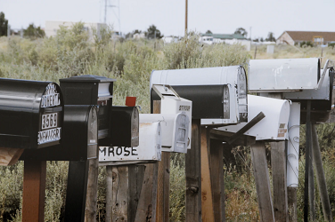

# Berufsfeld im Fokus
## Einführung in Öffentlichkeitsarbeit

Sommersemester 2021
Felix Werthschulte, Dozent für Neue Medien
Newsletter und Presseverteiler

---

## Inhalt

- Was ist ein Newsletter?
- Zweck, Inhalte
- Abonnement
- Erstellung, Gestaltung
- Technik
- Presseverteiler
- Aufgabe zum nächsten Mal

---

## Was ist ein Newsletter?

- elektronisches Rundschreiben (E-Mail)
- erscheint regelmäßig (z.B. monatsweise)
- Herausgeber sind i.d.R. Institutionen (Ensembles, Orchester, Theater, ...)
- informiert über Veranstaltungen, Events, Angebote, ...

---

## Zweck des Newsletters

- Information
- Werbung
- Online-Präsenz
- Bindung an die Kunden

---

## Inhalte eines Newsletters

- "Kopf":
  - Name/Logo des Ensembles
  - Datum oder Monatsangabe
- Bilder
- Editorial-Text
- weitere Informationen, z.B. zu einzelnen Events
- "Abbinder"
  - Impressum, Datenschutz (bzw. Links)
  - Kontakt
  - Social Media
  - Hinweis, um Newsletter abzubestellen

---

## Abonnement eines Newsletters

- wichtig: Nutzer*innen müssen Empfang des Newsletters aktiv zustimmen
- Newsletter-Abo muss beworben werden
  - auf eigener Homepage
  - in Social Media
  - bei Konzerten (Flyer)

---

## Umgang mit Abonnements

- je aktueller und größer die Abonements-Liste, desto besser
- Niemand will Spam!
- Abmeldungen schnell bearbeiten (Automatisierung?)
- Rückmeldungen ernst nehmen

---

## Newsletter erstellen?

- Lohnt sich ein eigener Newsletter?
- Viele Institutionen, Einrichtungen versenden Newsletter
- wenn kein eigener Versand, um Aufnahme in einen anderen Newsletter bemühen

---

## Newsletter erstellen!

- spezielle E-Mail-Adresse, z.B. "newsletter@ensemble-casselissimo.de"
- Versandmöglichkeiten
  - reiner Text
  - HTML (formatierter Text, Überschriften, Links, ...)
  - PDF im Anhang einer Mail

---

## Gestaltungsprinzipien

- persönliche Ansprache, wie in einem Brief (Zielgruppe?)
- mehr Text als in Social Media, aber nicht zu viel
- wichtige Infos (Titel, Daten) gut hervorheben
- bei Gestaltung auf Endgeräte achten (mobile Nutzung)

---

## Datenschutz

- **Einwilligungsverfahren**: Bestätigung, dass Inhaber der E-Mail-Adresse mit der Nutzung der Adresse und dem Empfang einverstanden ist
- **Verwendung der Daten**: Daten dürfen nur für den Versand des Newsletters verwendet werden, keine Weitergabe
- **Recht auf Widerruf**: Einwilligung, Speicherung der Daten kann immer vom Nutzer zurückgenommen werden

---

## Programme zum Erstellen eines Newsletters

- E-Mail-Programme (z.B. [Mozilla Thunderbird](https://www.thunderbird.net/de/) o.ä.)
- Newsletter-Software (z.B. [SuperMailer](https://www.supermailer.de) o.ä.)
- Newsletter-Dienste (z.B. [MailChimp](https://mailchimp.com/de/), [sendinblue](https://de.sendinblue.com) o.ä.)

---

## Beispiel: Newsletter Staatstheater Kassel

[Newsletter Staatstheater Kassel](./Newsletter-Staatstheater-Kassel)

---

## Presseverteiler

- Ähnlichkeit zum Newsletter: Verteiler-Liste
- dient dem Versand von Pressemitteilungen
- Ansprache kann spezieller, kürzer etc. sein
- muss individuell nach Region, Zielgruppe zusammengestellt werden

---

## Aufgaben zum nächsten Mal

- Recherchiert 4 Kultur-Institutionen aus Kassel, bei denen Newsletter abonniert werden können. Ihr könnt dazu die Seite [Kulturtopografie Kassel](https://www.kulturtopografie-kassel.de/uebersicht.html) nutzen.
- Recherchiert 4 Medien in Kassel/Hessen, die man in einen Kultur-Presseverteiler aufnehmen könnte.
- Verfasst eine kurzes Editorial für einen Newsletter, um euer Event anzukündigen (500 Zeichen). In der Übung richtet er sich an die Mitglieder eines Fördervereins eurer Institution.
- Aufgabe bis 12.5., 12 Uhr per Mail an mich.
