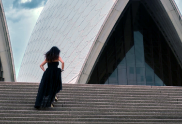

# Berufsfeld im Fokus
## Einführung in Öffentlichkeitsarbeit

Sommersemester 2021
Felix Werthschulte, Dozent für Neue Medien
Künstler-Biografie

---

## Inhalt

- Was ist eine Künstlerbiografie?
- Wozu dient eine Künstlerbiografie?
- Inhaltliche Elemente
- Sortier-Spiel
- Gestaltung, Format
- Redaktionelle Fragen
- Aufgabe zum nächsten Mal

---

## Was ist eine Künstlerbiografie?

- Beschreibung des Lebenslaufs
- Darstellung des künstlerischen Werdegangs ("Vita")
- Fließtext

---

## Beispiele

[Anne Sophie Mutter](https://www.anne-sophie-mutter.de/seite/biographie/vita-anne-sophie-mutter/)
[Maximilian Hornung](https://www.maximilianhornung.com/vita.html)

---

## Wozu dient eine Künstlerbiografie?

- Öffentlichkeitsarbeit
- positive Selbstdarstellung (Image)
- Aufzählung von bedeutenden Karriere-Schritten (Meilensteinen)
- Information für das Publikum (Programmheft, Internet)
- Information für die Presse (Pressemappe, Internet)

---

## Inhaltliche Elemente (1)

1. Einleitung (wichtige Eigenschaften)
2. Aktuelle Tätigkeit/Engagements (z.B. Artist in Residence)
3. Zusammenarbeit mit anderen Künstler*innen
4. Mitwirkung in Ensembles (Orchester, Kammermusik etc.)
5. Diskografie

---

## Inhaltliche Elemente (2)

6. Auszeichnungen und Preise
7. Geburt, Ausbildung
8. Förderung durch Stiftungen etc.
9. Instrument, falls besonders (Stradivari etc.)

---

## Inhaltliche Elemente (3)

- Elemente können verschieden ausführlich sein
- Reihenfolge der Abschnitte kann wechseln
- bei Ensembles: Informationen zu einzelnen Künstler*innen
- aber: Länge des gesamten Textes beachten!

---

## Sortier-Spiel

[Vita Franz Holzhauser](https://padlet.com/felix_we/bio_sortieren)

---

## Gestaltung und Format

- als fließender Text, keine Stichpunkte
- so viel Information wie nötig
- so knapp wie möglich
- Schreibweisen von Namen, Werken überprüfen!
- Format: Word-Dokument -> PDF
- in der Regel _ohne_ Formatierungen (kein Fett, Kursiv)

---

## Redaktionelle Fragen

- Redaktion (z.B. bei Konzertveranstalter) passt Infos an
- überwachen, ob alles richtig übernommen wurde

---

## Aufgabe zum nächsten Mal

- eigene Künstlerbiografie schreiben (max. 500 Zeichen)
- passend zum fiktiven Event
- bis 26.05., 12.00 Uhr per E-Mail
