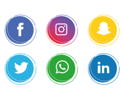

# Berufsfeld im Fokus
## Einführung in Öffentlichkeitsarbeit

Sommersemester 2021
Felix Werthschulte, Dozent für Neue Medien
Social Media

---

## Inhalt

Definition
Social Media und Künstler*innen?
Rollenspiel

---

# Was ist für euch Social Media?

---

### Definition (1/3)

Social Media bezeichnet eine Sammlung von Online-Kommunikationskanälen, die
- community-basiertem Input
- sozialer Interaktion
- der gemeinsamen Nutzung von Inhalten ("Teilen") und
- der Zusammenarbeit
dienen.

---

### Definition (2/3)

Social Media besteht aus Tools, Diensten und Kommunikationswegen, die webbasierte Verbindungen zwischen Menschen mit gemeinsamen Interessen erleichtern sollen.

---

### Definition (3/3)

Soziale Medien sind keine "Medien", sondern Plattformen für Interaktion und Vernetzung.

---

### Social Media Kanäle

2 Fragen an euch:
* Was können allgemein Gründe sein, um Social Media als Künstler*in zu nutzen?
* Was kann dagegen sprechen?

---

### Rollenspiel: Welcher Social-Media-Kanal passt zu uns?

Aufgabe:
- Alle Teilnehmer des Seminars bilden ein Ensemble, das "Spohr-Orchester".
- Es gibt 4 Teams: Facebook, Instagram, Twitter, TikTok,
- Jedes Team trifft sich in einem Breakout-Room.
- Dort diskutiert ihr Vorteile eines Social-Media-Accounts.

---

- Ihr könnt auch Nachteile der anderen besprechen.
- Nach 10 Minuten treffen wir uns wieder.
- Ein Sprecher/eine Sprecherin trägt die Gründe vor.
- Am Schluss stimmen wir per Chat ab, welches Medium wir nutzen.

---

### Aufteilung der Teams

Mitglieder aufteilen.

[Cryptpad Team Facebook](https://cryptpad.fr/pad/#/2/pad/edit/D7FH-t8ZL2hImLk6g7CnSTId/)
[Cryptpad Team Instagram](https://cryptpad.fr/pad/#/2/pad/edit/qmrM7EMPOkBWFPfh1nCtYrKg/)
[Cryptpad Team Twitter](https://cryptpad.fr/pad/#/2/pad/edit/39Os2FhkGXjWWvdM1ZuXQBtx/)
[Cryptpad Team TikTok](https://cryptpad.fr/pad/#/2/pad/edit/jch6SlW9yUh-HT1khrLoR9hz/)

---

# Los gehts!

---

## Vorstellung/Diskussion

1. Facebook
2. Instagram
3. Twitter
4. TikTok

---
